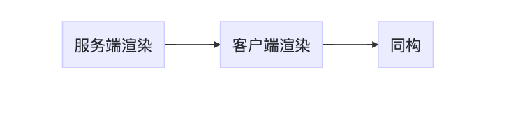
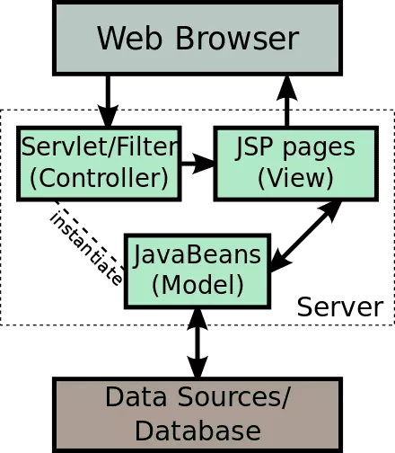
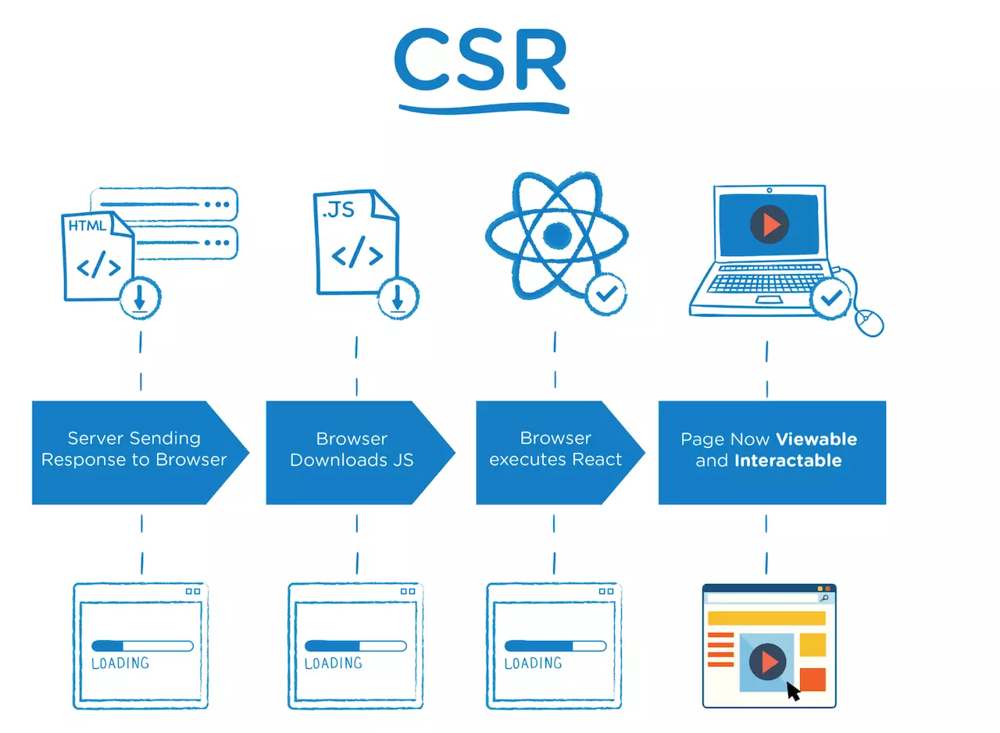
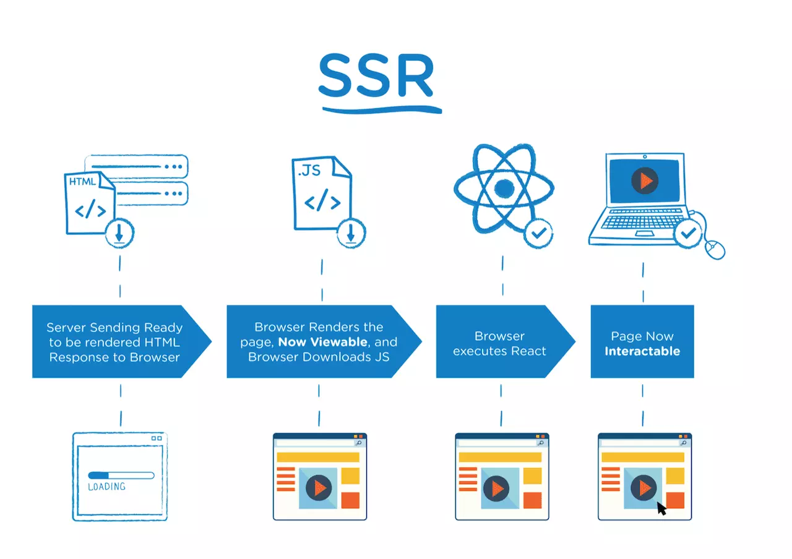
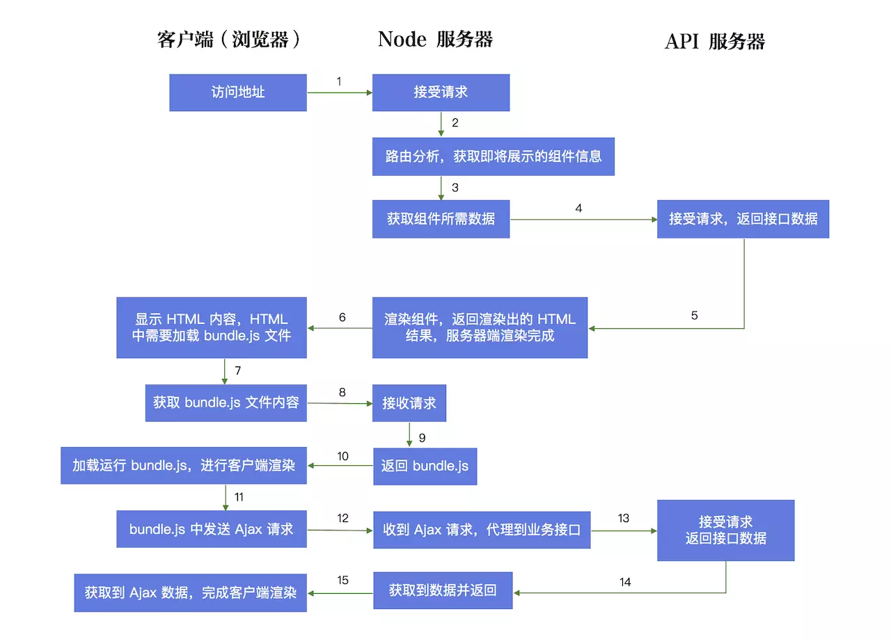
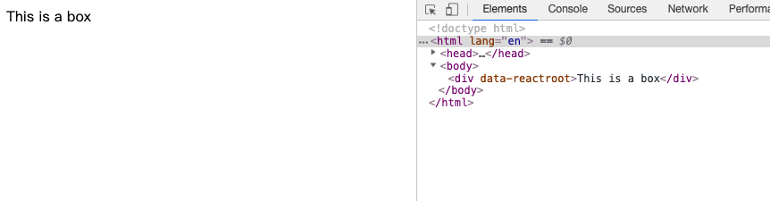

## 前端页面渲染发展史



## 服务端渲染

页面由服务端直接返回给浏览器，路由为服务端路由，URL 的变更会刷新页面，原理与 ASP，PHP 等传统后端框架类似。


## 客户端渲染（CSR）

页面在 JavaScript，CSS 等资源文件加载完毕后开始渲染，路由为客户端路由，也就是我们经常谈到的 SPA（Single Page Application）。



## 同构（即 SSR）

编写的 JavaScript 代码可同时运行在浏览器及 Node.js 两套环境中，用服务端渲染来提升首屏的加载速度，首屏之后的路由由客户端控制，即在用户到达首屏后，整个应用仍是一个 SPA。



在明确了这三种渲染方案的具体含义后，我们可以发现，不论是客户端渲染还是服务端渲染，都有着其明显的缺陷，而同构显然是结合了二者优点之后的一种更好的解决方案。

## CSR 和 SSR 优缺点

| 渲染模式 | 优点 | 缺点 |
| -------- | ---- | ---- |
| CSR | 网络传输数据量小、减少服务器压力、前后端分离、局部刷新、无需每次请求完整页面、交互好可实现各种效果 | 不利于 SEO、爬虫看不到完整的程序源码、首屏渲染慢
| SSR | 首屏渲染快、利于 SEO、可以生成缓存片段、生成静态文件、节能（相比客户端渲染的耗电）| 用户体验较差、不易维护

## 使用 SSR 技术的主要因素

1. CSR 项目中 TTFP （Time To First Page）时间比较长，参考之前的图例，在 CSR 的页面渲染流程中，首先要加载 HTML 文件，之后要下载页面所需的 JavaScript  文件，然后 JavaScript 文件渲染生成页面。在这个渲染过程中至少涉及到两个 HTTP 请求周期，所以会有一定的耗时，这也是为什么大家在低网速下访问普通的 React 或者 Vue 应用时，初始页面会有出现白屏的原因。
2. CSR 项目的 SEO 能力极弱，在搜索引擎中基本上不可能有好的排名。因为目前大多数搜索引擎主要识别的内容还是 HTML，对 JavaScript 文件内容的识别都还比较弱。如果一个项目的流量入口来自于搜索引擎，这个时候你使用 CSR 进行开发，就非常不合适了。

## 启用 SSR 技术的架构图



## 为什么会出现 SSR

SSR 的工程中，React 代码会在客户端和服务器端各执行一次。你可能会想到，这没什么问题，因为都是 JavaScript 代码，既可以在 Node 执行，也可以在浏览器上运行。但是如果你的代码操作了 DOM，那就有问题了。因为 Node 没有 DOM。

好在 React 引入虚拟 DOM 的概念，虚拟 DOM 是真实 DOM 的一个 JavaScript 对象，React 在做页面操作时，实际上不是操作真实 DOM，而是操作虚拟 DOM，也就是操作普通对象。在服务器，我可以操作 JavaScript 对象，判断环境是服务器环境，我们把虚拟 DOM 转换成字符串输出；在客户端，也同样可以判断是客户端环境，直接将虚拟 DOM 转成真实 DOM，完成页面渲染。

## 如何使用 SSR 技术

由于 `SSR` 的代码与 `CSR` 的代码不一样，所以我们新建 `webpack.server.js` 文件并且修改 `React` 代码。

1. 假使你已经拥有 express 服务器，里面代码如下:
    ```js
    var express = require('express');
    var app = express();

    app.get('/', (req, res)=>{
        res.send(`
            <!DOCTYPE html>
            <html lang="en">
            <head>
                <meta charset="UTF-8">
                <meta name="viewport" content="width=device-width, initial-scale=1.0">
                <meta http-equiv="X-UA-Compatible" content="ie=edge">
                <title>Hello World</title>
            </head>
            <body>
                <div>Hello World</div>
            </body>
            </html>
        `)
    })
    app.listen(8569)
    ```
2. 启动代码，打开 localhost:8569 可以看到页面上显示了 Hello World
3. 修改 webpack 与 react 代码

    > `libraryTarget` 配置如何暴露 library。 `umd` 意味着将你的 library 暴露为所有的模块定义下都可运行的方式。它将在 CommonJS、AMD 环境下运行，或将模块导出到 global 下的变量。

    ```js
    // webpack
    ...

    module.exports = {
        mode: 'production',
        entry: './src/module/demo.js',
        output: {
            filename: 'demo-server.js',
            path: path.join(__dirname, 'dist'),
            libraryTarget: 'umd'
        },
        ...
    }
    ```

    ```js
    //react
    const React = require('react');
    class Box extends React.Component{
        render(){
            return (
                <div>This is a box</div>
            )
        }
    }
    module.exports = <Box />
    ```
4. 修改 express 代码

    > Node 没有 window，需要 hack

    ```js
    if(typeof window === 'undefined'){
        global.window = {}
    }
    ...
    const SSR = require('../dist/demo-server.js');
    const { renderToString } = require('react-dom/server');
    app.get('/', (req, res)=>{
        res.end(`
            ...
            <body>
                ${renderToString(SSR)}
            </body>
            ...
        `)
    })

    app.listen(8569)
    ```
5. 启动代码，打开 localhost:8569，你会看到下图所示。

    

6. 大功告成，一个简单的 SSR 已经实现了。

## 样式解析与初始数据加载

大家都知道 Node 没有样式解析，也没有 XMLHttpRequest，这些我们在做 SSR 的时候应该怎么处理？我们可以用客户端打出来的代码部署静态服务器，在 `.html` 的代码里面加入占位符，然后在服务器端做占位符替换。这样，当客户端访问页面的时候，我们通过外链加载样式，再通过插入 json 对象来获取初始页面数据。

外链加载样式部分代码

```html
<!DOCTYPE html>
<html lang="en">
<head>
    <meta charset="UTF-8">
    <meta name="viewport" content="width=device-width, initial-scale=1.0">
    <meta http-equiv="X-UA-Compatible" content="ie=edge">
    <title>demo</title>
<link href="main.77f6fd9c.css" rel="stylesheet"></head>
<body>
    <div id="root"><!-- html-placeholder --></div>
<script type="text/javascript" src="https://lib.baomitu.com/react/16.8.6/umd/react.development.js"></script><script type="text/javascript" src="https://lib.baomitu.com/react-dom/16.8.6/umd/react-dom.development.js"></script><script type="text/javascript" src="demo-server.js"></script></body>
</html>
```

```js
// express
if(typeof window === 'undefined'){
    global.window = {}
}

const express = require('express');
const app = express();
const SSR = require('../dist/demo-server.js');
const { renderToString } = require('react-dom/server');
const fs = require('fs');
const path = require('path');

const template = fs.readFileSync(path.join(__dirname, '../dist/demo.html'), 'utf-8');

app.use(express.static('../dist/'))

app.get('/', (req, res)=>{
    let html = template.replace('<!-- html-placeholder -->', renderToString(SSR));
    res.end(html)
})

app.listen(8569)
```

## 参考文献

- [React 中同构（SSR）原理脉络梳理](https://juejin.im/post/5bc7ea48e51d450e46289eab)
- [玩转webpack](https://time.geekbang.org/course/intro/190)