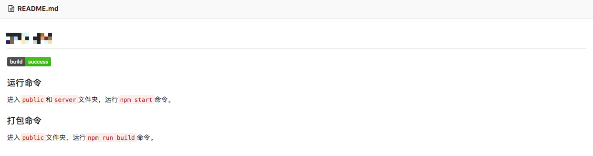
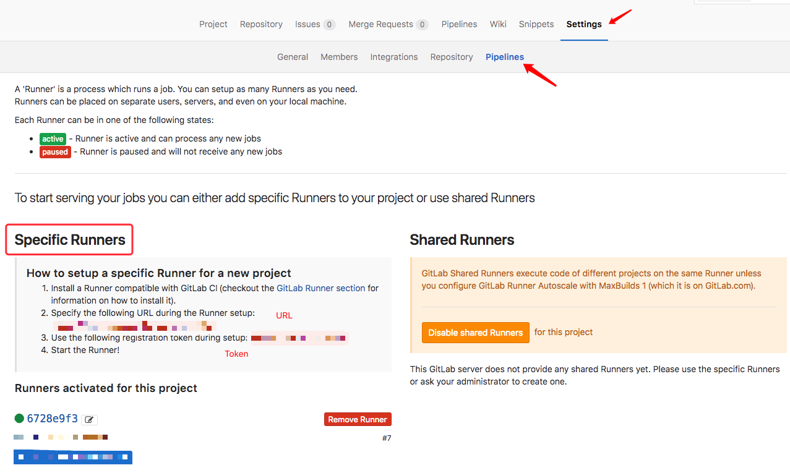
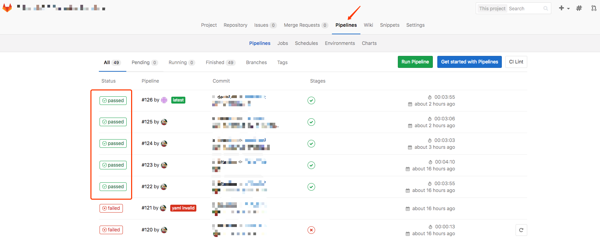
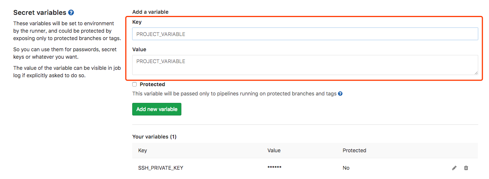

# 基于 GitLab CI 搭建前端自动构建环境

## 什么是持续集成 ?

持续集成（Continuous integration，简称CI）指的是，频繁地（一天多次）将代码集成到主干。

## GitLab CI

### 什么是 GitLab CI ?

`GitLab CI` 是 `GitLab Continuous Integration` （Gitlab 持续集成）的简称。从 `GitLab` 的 8.0 版本开始，`GitLab` 就全面集成了 `Gitlab-CI`,并且对所有项目默认开启。只要在项目仓库的根目录添加 `.gitlab-ci.yml` 文件，并且配置了 `Runner` （运行器），那么每一次合并请求（MR）或者 `push` 都会触发 `CI pipeline`。

如果一切运行正常，你将得到与 commit 关联的标记。如图：



### 什么是 Pipeline ?

一次 `Pipeline` 其实相当于一次构建任务，里面可以包含多个流程，如安装依赖、运行测试、编译、部署测试服务器、部署生产服务器等流程。
任何提交或者 Merge Request 的合并都可以触发 `Pipeline`，如下图所示：

```

+------------------+           +----------------+
|                  |  trigger  |                |
|   Commit / MR    +---------->+    Pipeline    |
|                  |           |                |
+------------------+           +----------------+

```

### 什么是 Stages ?

`Stages` 表示构建阶段，说白了就是上面提到的流程。
我们可以在一次 `Pipeline` 中定义多个 `Stages`，这些 `Stages` 会有以下特点：

+ 所有 `Stages` 会按照顺序运行，即当一个 `Stage` 完成后，下一个 `Stage` 才会开始
+ 只有当所有 `Stages` 完成后，该构建任务 (`Pipeline`) 才会成功
+ 如果任何一个 `Stage` 失败，那么后面的 `Stages` 不会执行，该构建任务 (`Pipeline`) 失败

因此，`Stages` 和 `Pipeline` 的关系就是：

```
+--------------------------------------------------------+
|                                                        |
|  Pipeline                                              |
|                                                        |
|  +-----------+     +------------+      +------------+  |
|  |  Stage 1  |---->|   Stage 2  |----->|   Stage 3  |  |
|  +-----------+     +------------+      +------------+  |
|                                                        |
+--------------------------------------------------------+
```

### 什么是 Jobs ?

`Jobs` 表示构建工作，表示某个 Stage 里面执行的工作。
我们可以在 `Stages` 里面定义多个 `Jobs`，这些 `Jobs` 会有以下特点：

+ 相同 `Stage` 中的 `Jobs` 会并行执行
+ 相同 `Stage` 中的 `Jobs` 都执行成功时，该 Stage 才会成功
+ 如果任何一个 `Job` 失败，那么该 `Stage` 失败，即该构建任务 (`Pipeline`) 失败

所以，`Jobs` 和 `Stage` 的关系图就是：

```

+------------------------------------------+
|                                          |
|  Stage 1                                 |
|                                          |
|  +---------+  +---------+  +---------+   |
|  |  Job 1  |  |  Job 2  |  |  Job 3  |   |
|  +---------+  +---------+  +---------+   |
|                                          |
+------------------------------------------+

```

### 安装配置

> 安装环境为 `Ubuntu 16.04.4 LTS (GNU/Linux 4.4.0-105-generic x86_64)` ，`docker` 版本为 `Docker version 18.03.1-ce, build 9ee9f40`

+ 安装 `gitlab-ci-multi-runner`

```powershell

# For Debian/Ubuntu
curl -L https://packages.gitlab.com/install/repositories/runner/gitlab-ci-multi-runner/script.deb.sh | sudo bash

# For RHEL/CentOS
curl -L https://packages.gitlab.com/install/repositories/runner/gitlab-ci-multi-runner/script.rpm.sh | sudo bash

```

+ 查看 `docker images`

```powershell

sudo docker images

```


### 如何使用 GitLab CI ?

+ 在项目根目录创建 `.gitlab-ci.yml` 文件，文件代码如下：

>  `stages` 定义 `Stages`，默认有三个 `Stages`，分别是 `build`，`test`，`deploy`。`Job.only` 定义只有 `develop` 分支会触发相关的 `Jobs`。

```powershell

stages:
    - build
job1:
    # 是否开启 debug 模式
    # variables:
    #     CI_DEBUG_TRACE: "true"
    stage: build
    tags:
        - 新建 runner 的标签
    only:
        - develop
    script:
        - cd public
        - npm i
        - npm run build

```

+ 进入 `pipeline` 配置页面



+ 记下 `URL` 和 `Token`，留以注册 `runner` 使用

### 注册 runner

+ 注册 `runner`,`runner` 注册成功之后，你会在 `pipeline` 配置页面看见 `specific runners` 下多出了你刚新增的 `runner`。

```powershell

sudo gitlab-ci-multi-runner register

# Please enter the gitlab-ci coordinator URL (e.g. https://gitlab.com )

你的 URL

# Please enter the gitlab-ci token for this runner

你的 Token

# Please enter the gitlab-ci description for this runner

my-runner

# Please enter the gitlab-ci tags for this runner (comma separated)

my-runner

Whether to run untagged builds [true/false]:

false

Whether to lock Runner to current project [true/false]:

false

# Please enter the executor: shell, docker, docker-ssh, ssh?

docker

# Please enter the Docker image (eg. ruby:2.1):

node:9.4.0

```

+ 卸载  `runner`

```powershell

sudo gitlab-ci-multi-runner unregister --url url地址 --token tocken值

```

+ 查看 `runner` 状态

```powershell

sudo gitlab-ci-multi-runner status

```

+ 查看 `runner` 列表

```powershell

sudo gitlab-ci-multi-runner list

```

+ 查看 `runner` 配置文件

```powershell

sudo vim /etc/gitlab-runner/config.toml

```

## 大功告成

切换到项目 `Pipelines` 页面，发现出现以下情况，则代表你的 `runner` 已经配置完成，你的每一次提交都会触发 `runner`。



## 备注

+ 使用 GitLab CI 克隆私有仓库时候，会提示 `Host key verification failed`。

    需要做如下配置，`Key` 写入 `SSH_PRIVATE_KEY`，`Value` 写入 服务器 `private SSH key`。然后在 `.gitlab-ci.yml` 文件前面写入如下代码，并保存。

    

    ```powershell

    before_script:
        - 'which ssh-agent || ( apt-get update -y && apt-get install openssh-client -y )'
        # Run ssh-agent (inside the build environment)
        - eval $(ssh-agent -s)
        # Add the SSH key stored in SSH_PRIVATE_KEY variable to the agent store
        - ssh-add <(echo "$SSH_PRIVATE_KEY")
        - mkdir -p ~/.ssh
        - '[[ -f /.dockerenv ]] && echo -e "Host *\n\tStrictHostKeyChecking no\n\n" > ~/.ssh/config'

    ```

## 参考链接

[Getting GitLab CI to clone private repositories](https://stackoverflow.com/questions/25689231/getting-gitlab-ci-to-clone-private-repositories/44577067)

[用 GitLab CI 进行持续集成](https://scarletsky.github.io/2016/07/29/use-gitlab-ci-for-continuous-integration/)