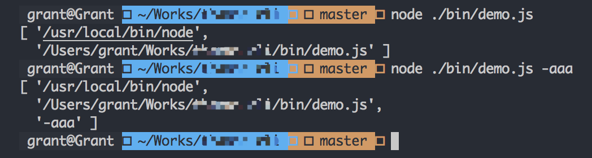

# 一起来学习如何用 Node 来制作 CLI

## CLI 是什么

提起 `CLI`，不由得会想起 `vue-cli` 和 `angular-cli`，它们都是基于 `Node` 的命令行工具。

## 为什么要开发一个 `CLI`

假设你现在要建立一个新项目 ，这个项目配置和之前的项目配置是一样的。在你没有 `CLI` 的时候，你只能通过复制、粘贴来进行。然而，当你有了 `CLI`，你就可以通过命令来完成这些步骤。当然，你可以说就新建一个项目，完全没必要再开发一个 `CLI` 工具。那如果你要新建 n 个项目呢？这个时候，有 `CLI` 和没有 `CLI` 的区别就体现出来了。

## 怎么开发一个 `CLI`

### 准备

开发一个 `CLI`，需要用到以下工具：

+ [commander.js](https://github.com/tj/commander.js/)
+ [ShellJS](https://github.com/shelljs/shelljs)
+ [download-git-repo](https://github.com/flipxfx/download-git-repo)
+ [chalk](https://github.com/chalk/chalk)
+ [inquirer](https://github.com/SBoudrias/Inquirer.js/)
+ [ora](https://github.com/sindresorhus/ora)

### 开始

新建一个文件夹，名称起做 `demo-cli`，并在文件夹内 `npm init`。在 `demo-cli` 文件夹内，新建 `bin` 文件夹，并在该文件夹内新建 `index.js` 文件。紧接着，打开 `demo-cli` 文件夹内的 `package.json` 文件，在里面新增如下命令。

```json
{
    "bin": {
        "demo": "./bin/index.js"
    }
}
```

这句代码的意思是指，在你使用 `demo` 命令的时候，会去执行 `bin` 文件夹下的 `index.js` 文件。

这时候，我们在 `index.js` 文件，写入以下代码。

```js

#!/usr/bin/env node

console.log('hello CLI');

```

在 `demo-cli` 目录下依次运行 `npm link`、`demo`，这个时候，你会发现控制台输出了 `hello CLI`。


> 备注：
> + `#!/usr/bin/env node` 告诉操作系统用 `Node` 来运行此文件
> + `npm link` 作用主要是，在开发 `npm` 模块的时候，我们会希望边开发边调试。这个时候，`npm link` 就派上用场了。

### 逐步深入

1. 在 `index.js` 文件内，写入以下代码。

```js
#!/usr/bin/env node

const program = require('commander');

program
    .version('1.0.0', '-v, --version')
    .command('init <dir>', 'generate a new project')
    .parse(process.argv);
```

`commander` 提供了一种使用 `node.js` 来开发命令行的可能性。我们可以通过 `commander` 的 `option` 方法，来定义 `commander` 的选项，当然，这些定义的选项也会被作为该命令的帮助文档。

+ `version`：用来定义版本号。`commander` 默认帮我们添加 `-V, --version` 选项。当然，我们也可以重设它。
+ `command`：`<> ` 代表必填，`[]` 代表选填。当 `.command()` 带有描述参数时，不能采用 `.action(callback)` 来处理子命令，否则会出错。这告诉 `commander`，你将采用单独的可执行文件作为子命令。
+ `parse`：解析 `process.argv`，解析完成后的数据会存放到 `new Command().args` 数组中。`process.argv` 里面存储内容如下：
    
所以，我们可以通过 `program.args[0]` 来取出 `dir` 的值。

> 问题：为什么当 `command` 没有描述参数，且 `parse` 方法使用链式调用会报错？（*猜想：`command` 有 `desc` 参数时，返回的是 `this`，当没有 `desc` 参数时，返回的是新对象*，根据 `API Document` 得出）

    ```js
    // 正确
    program
        .version('1.0.0', '-v, --version')
        .command('init <dir>', 'generate a new project')
        .action(function(dir, cmd){
            console.log(dir, cmd)
        })
        .parse(process.argv);

    // 正确
    program
        .version('1.0.0', '-v, --version')
        .command('init <dir>', 'generate a new project')
        .action(function(dir, cmd){
            console.log(dir, cmd)
        })
    program.parse(process.argv);

    // 正确
    program
        .version('1.0.0', '-v, --version')
        .command('init <dir>')
        .action(function(dir, cmd){
            console.log(dir, cmd)
        })
    program.parse(process.argv);

    // 错误
    program
        .version('1.0.0', '-v, --version')
        .command('init <dir>')
        .action(function(dir, cmd){
            console.log(dir, cmd)
        })
        .parse(process.argv);
    ```

2. 在 `bin` 文件下创建 `demo-init.js` 文件，部分代码如下：

```js

#!/usr/bin/env node

const shell = require('shelljs');
const program = require('commander');
const inquirer = require('inquirer');
const download = require('download-git-repo');
const ora = require('ora');
const fs = require('fs');
const path = require('path');
const spinner = ora();

program.parse(process.argv);

let dir = program.args[0];

const questions = [{
    type: 'input',
    name: 'name',
    message: '请输入项目名称',
    default: 'demo-static',
    validate: (name)=>{
        if(/^[a-z]+/.test(name)){
            return true;
        }else{
            return '项目名称必须以小写字母开头';
        }
    }
}]

inquirer.prompt(questions).then((answers)=>{
    // 初始化模板文件
    downloadTemplate(answers);
})

function downloadTemplate(params){
    spinner.start('loading');
    let isHasDir = fs.existsSync(path.resolve(dir));
    if(isHasDir){
        spinner.fail('当前目录已存在!');
        return false;
    }
    // 开始下载模板文件
    download('gitlab:git.gitlab.com/demo-static', dir, {clone: true}, function(err){
        if(err){
            spinner.fail(err);
        };
        updateTemplateFile(params);
    })
}

function updateTemplateFile(params){
    let { name, description } = params;
    fs.readFile(`${path.resolve(dir)}/public/package.json`, (err, buffer)=>{
        if(err) {
            console.log(chalk.red(err));
            return false;
        }
        shell.rm('-f', `${path.resolve(dir)}/.git`);
        shell.rm('-f', `${path.resolve(dir)}/public/CHANGELOG.md`);
        let packageJson = JSON.parse(buffer);
        Object.assign(packageJson, params);
        fs.writeFileSync(`${path.resolve(dir)}/public/package.json`, JSON.stringify(packageJson, null, 2));
        fs.writeFileSync(`${path.resolve(dir)}/README.md`, `# ${name}\n> ${description}`);
        spinner.succeed('创建完毕');
    });
}

```

+ `inquirer` 主要提供交互式命令的功能。`validate` 返回 `true` 代表输入值验证合法，如果返回任意字符串，则会替代默认的错误消息返回。
+ 通过 `Node` 中 `fs` 模块来判断文件夹是否已存在。
    > `path.resolve` 方法用于将相对路径转为绝对路径。它可以接受多个参数，依次表示所要进入的路径，直到将最后一个参数转为绝对路径。如果根据参数无法得到绝对路径，就以当前所在路径作为基准。除了根目录，该方法的返回值都不带尾部的斜杠。

## 参考

+ [Commander.js 中文文档](https://github.com/tj/commander.js/blob/master/Readme_zh-CN.md)
+ [JavaScript 标准参考教程（alpha）](http://javascript.ruanyifeng.com/nodejs/path.html#toc1)
