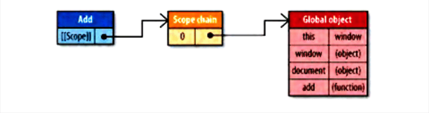
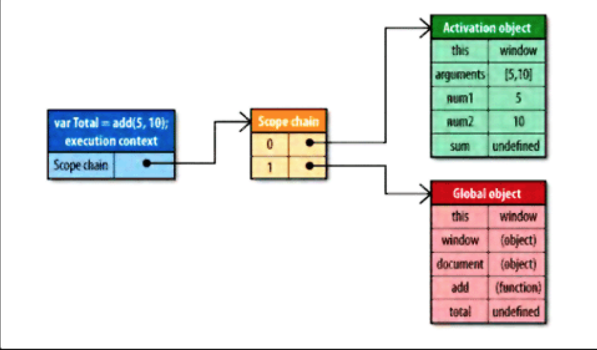

# 数据存储

> 数组和对象成员的读取慢，字面量和局部变量读取快。

## 作用域相关

> 每一个 JavaScript 函数都是 Function 对象的一个实例。 Function 对象同其他对象一样，拥有可以编程访问的属性和一系列不能通过代码访问，仅提供 JavaScript 引擎读取的内部属性。其中一个内部属性是 `[[Scope]]`。`[[Scope]]`属性包含了创建此函数的作用域对象的集合。

当 add 函数创建后，它的作用域链将插入一个对象变量，这个全局对象代表着所有在全局范围内定义的变量。

```js

function add(num1, num2){
    var sum = num1 + num2;
    return sum;
}

```

如图为它们之间的关系：



函数 add 的作用域将会在执行时用到。假设执行如下代码：

```js

var total = add(5, 10);

```

那么此时，作用域则为：



在函数执行过程中，每遇到一个变量，都会经历一次查找，如果作用域链越深，那么查找越慢。所以，尽量使用局部变量。

# DOM方面

> DOM 的慢是有原因的。浏览器通常会把 DOM 和 JavaScript 独立实现。比如 IE 中，JavaScript 的实现位于 jscript.dll 文件中； DOM 的实现则存在另一库中，名为 mshtml.dll（ 内部为 Trident ）。这个分离允许其他技术和语言，比如 VBScript ，能共享使用 DOM 以及 Trident 提供的渲染函数。正因为如此，两个相互独立的功能只能通过接口进行彼此连接，就会产生消耗。

## DOM 的访问和修改

+ 访问 DOM 的次数越多，代码运行速度越慢。通用的做法是：减少访问 DOM 的次数，把运算尽量留在 ECMAScript 这一端处理。

```js

// bad

function loop(){
    for(var i = 0; i < 15000; i++){
        dcoument.getElementById('app').innerHTML += 'a';
    }
}

// good

function loop(){
    var html = '';
    for(var i = 0; i < 15000; i++){
        html += 'a';
    }
    dcoument.getElementById('app').innerHTML = html;
}

```

## HTML 集合

> `document.getElementsByTagName()`、 `document.getElementsByClassName()`、 `document.getElementsByName()` 都返回一个类数组对象。这个对象一直与文档保持连接，每次你需要最新信息时，都会重复执行查询的过程，哪怕只是获取类数组对象的 length 。**读取一个数组的 length 比读取集合要快**。

```js

// 死循环
var alldivs = document.getElementsByTagName('div');
for(var i = 0; i < alldivs.length; i++){
    document.body.appendChild(document.createElement('div'));
}

```

> 对于任何类型的 DOM 访问，需要多次访问同一个 DOM 属性或方法需要多次访问时，最好用一个局部变量缓存此成员。当遍历一个集合时，第一优化原则是把集合存储在局部变量中，并把 length 缓存在循环外部。

## 重绘与重排

> 当 DOM 的变化影响了元素得几何属性（宽和高）--比如改变边框宽度或给段落增加文字，导致行数增加--浏览器需要重新计算元素得几何属性，同样其他元素的几何属性和位置也会受影响。浏览器会使渲染树中受到影响的部分失效，并重新构造渲染树。这个过程称之为`重排`。完成`重排`后，浏览器会重新绘制受到影响的部分到屏幕中，这个过程称之为`重绘`。

由于每次重排会产生计算消耗，大多数浏览器通过队列优化修改并批量执行来优化重排过程。然而，当使用`offsetTop`，`offsetLeft`，`offsetWidth`，`offsetHeight`，`scrollTop`，`scrollLeft`，`scrollWidth`，`scrollHeight`，`clientTop`，`clientLeft`，`clientWidth`，`clientHeight`，`getComputedStyle() (currentStyle in IE)` 会导致重新刷新队列。

当需要对 DOM 元素进行一系列操作时，可以通过 1.使元素脱离文档流 2.对其应用多重改变 3.把元素带回文档中来减少重绘和重排次数。让元素脱离文档流的三种方法：

+ 隐藏元素，修改，再显示
+ 使用文档片断，在当前 DOM 之外构建一个子树，再把它拷贝回文档
+ 把元素拷贝到一个脱离文档的节点，修改后再替换元素

# 算法和流程控制

## 循环

在要求运行速度时，基于函数的迭代比基于循环的要慢。例：

```js
var array = Array(1000000);

console.time();

array.forEach(function(value, index){

})

console.timeEnd(); // 183.984ms

console.time();

for(let i = 0; i < array.length; i++){

}

console.timeEnd(); // 3.454ms
```

## 条件语句

`if-else` 尽可能把最大概率出现的情况放在前面。