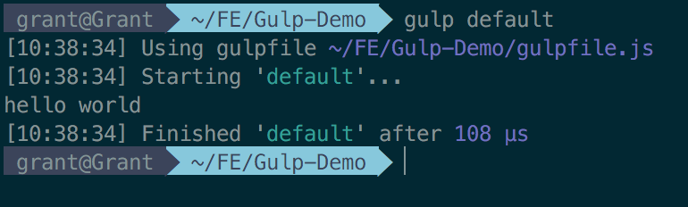
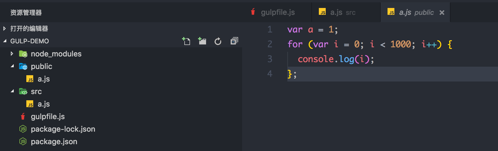

# 什么是Gulp

`gulp` 是一个自动化构建工具，用来增加工作流程。

# 如何使用

## 安装 `gulp-cli` ：

运行之前，先检测下本地是否安装过 gulp，如果未看见 `CLI Version 1.X`，那么请卸载掉 gulp，再安装 gulp-cli。因为在 gulp 4 的时候，CLI 和 gulp 将会分离。当然， CLI 现在同时可以在 3 和 4 里运行。

```js

gulp -v

npm rm gulp -g

npm install --global gulp-cli

```

## 初步入门

创建 gulpfile.js 文件，代码如下：

```js

var gulp = require('gulp');

gulp.task('default', ()=>{
    console.log('hello world');
});

```

运行 gulp 将会看见控制台输出 `hello world`。当然，你也可以通过使用 gulp default 运行。



## 第一个 Demo

运行以下代码：

gulpfile.js

```js

var gulp = require('gulp');

var beautify = require('gulp-beautify');

gulp.task('beautify', ()=>{
    gulp.src('./src/*.js')
        .pipe(beautify({indent_size: 2}))
        .pipe(gulp.dest('./public/'))
});

```

a.js

```js

var a=1;
for(var i=0;i<1000;i++){console.log(i);};

```

输出：这时，目录下会多出 public 文件夹，文件夹内会有一个 a.js 文件，里面的代码是美化后代码。



上面代码中，使用 gulp 模块的 task 方法指定任务 beautify。task 方法有两个参数，一个是任务名，一个是任务函数。在任务函数中，使用 gulp 模块的 src 方法，指定所要处理的文件，然后使用 pipe （管道）方法，将上一步的输出作为当前的输入，进行链式处理。在对文件进行美化之后，又调用了 gulp 的 dest 方法，将上一次的输出写入到public目录下。

# API

## src()

gulp 模块的 src 方法，用于产生数据流。它的参数表示要处理的文件，这些指定的文件会转换成数据流。参数写法：

+ js/a.js：指定确切的文件名。
+ js/*: 某个目录下所有文件，不会遍历到文件夹内部。
+ js/*.js：某个目录所有后缀名为js的文件。

src 的参数还可以是一个数组，用来指定多个成员。

```js

gulp.src(['./src/a.js', './src/c.js'])

```

## dest()

dest 方法将管道的输出写入文件夹，同时会继续输出文件流，所以可以继续调用 pipe 方法，进行多次写入。如果文件夹不存在，会新建文件夹。

## watch()

监视文件，一旦文件发生变动，就运行指定任务。

# 参考文献

+ [Gulp Sips: New Command Line Interface](https://github.com/gulpjs/gulp/blob/master/docs/getting-started.md)