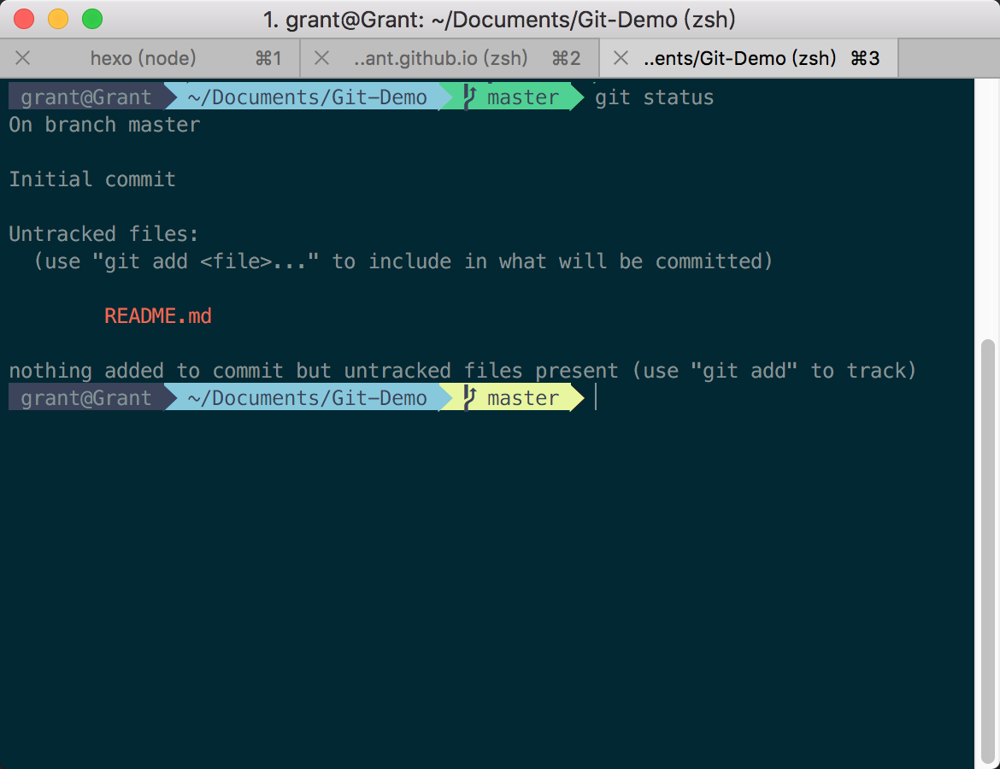
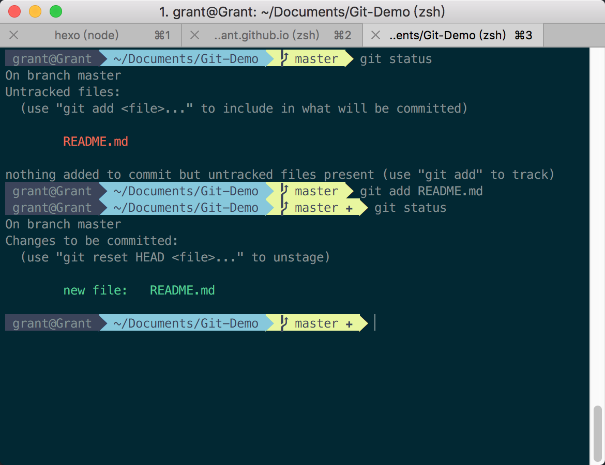
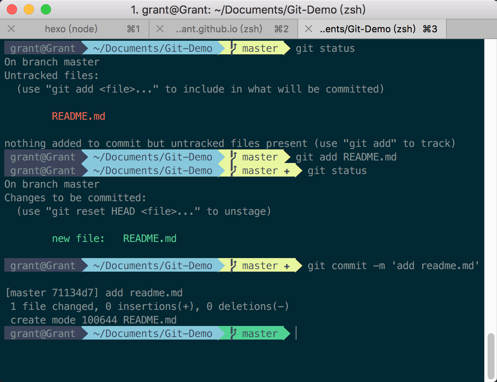
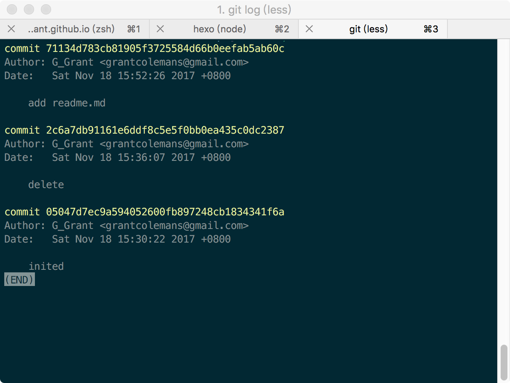
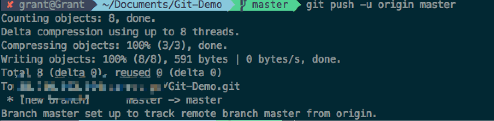
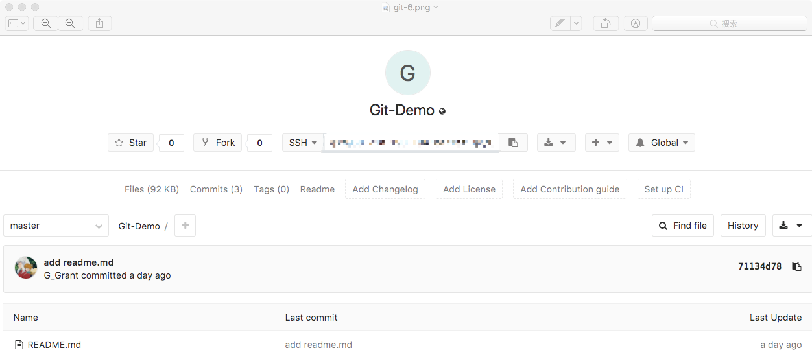
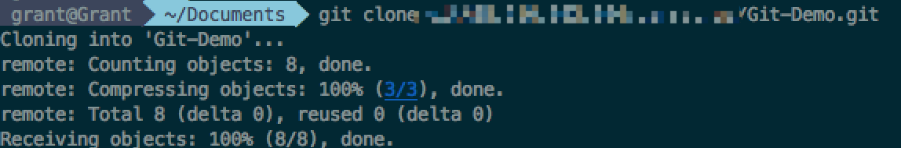

# Git 入门

`Git` 是一个版本控制工具，正因为它仅仅是一个工具，所以我们不必耗费很大的精力去学习那些永远不会用到的命令，但是常用的命令还是得必须会使用。当然，常见的版本控制工具还有 `SVN、TFS`。

## 什么是版本控制工具

版本控制工具--假设你写了一篇论文，后来的某一时间点，你修改了论文内容，过了一天后，发现更改之前的论文是正确的。当你没有版本控制工具时候，/(ㄒoㄒ)/~~。情况好一点，修改之前，备份了。但是，当这种操作在足够多的情况下，你的备份也就足够多，很容易乱掉。版本控制工具就是为了解决这种问题。

## 安装 Git

> 使用 `brew` 安装 `Git`。

```powershell

# 电脑未安装 `Homebrew`
/usr/bin/ruby -e "$(curl -fsSL https://raw.githubusercontent.com/Homebrew/install/master/install)"

# 电脑已安装 `Homebrew`
brew install git
```

## 新建一个 Git 仓库

新建一个名为 `Git-Demo` 的文件夹，执行以下命令。运行完成后，`Git` 仓库就建好了。

```powershell

git init
# Initialized empty Git repository in /Users/grant/Documents/Git-Demo/.git/

```

## 新建一个文件

在 `Git-Demo` 内新建一个名为 `README.md`文件后，运行 `git status`，你将看到下图所示。。



这时，运行 `git add README.md` 命令，该文件就被提交到缓存区了。



运行 `git commit -m 'add readme.md'`命令，该文件就被提交到仓库了。



当你想查询提交历史的时候，输入 `git log` 就可以查看。如果想退出查询界面，按下 `q` 就可以退出了。



## 关联远程仓库

关联到远程仓库，使用如下命令。

```powershell

git remote add origin git@XXX/Git-Demo.git

```

添加完成之后，是时候提交了。使用 `git push -u origin master` 命令。如图，就代表代码已经提交到远程仓库了。



> 可以使用 `git remote -v` 来查看关联的仓库。

这个时候，我们去 `gitlab` 上看下提交的结果。



## 生成 SSH Key

是不是发现自己无法提交？哈哈，那是因为提交到远程仓库，需要你拥有远程仓库的权限。这时，ssh key 就派上用场了。打开控制台执行以下命令来生成它。

```powershell

ssh-keygen -t rsa -C "XX@XX.com" # 邮箱账号

```

> ~/.ssh/id_rsa 是私钥，~/.ssh/id_rsa.pub 是公钥

接着打开公钥：

```powershell

cat ~/.ssh/id_rsa.pub # 输出公钥内容

```

复制输出内容，打开 `gitlab`，点击 `Settings`=>`SSH Keys`，把复制好的内容粘贴到 key 里面，然后为这个 key 起一个名字，点击 Add Key 就大功告成啦。

## 克隆仓库

当你已有一个远程仓库，你需要执行 `git clone git@XXX/Git-Demo.git`来把代码克隆到本地。如图，该远程仓库就已经被克隆下来了。



当你对改仓库做任何修改，同时想把修改都同步到远程仓库的时候，都需要依次执行。

```powershell

git add someFile

git commit -m 'update'

git push

```

## 备注

```powershell

# 全局配置

git config --global user.name "xxx"

git config --global user.email "xxx@xxx.com"

# 当前项目配置

git config --local user.name "xxx"

git config --local user.email "xxx@xxx.com"

# 查看本地分支

git branch

# 查看本地分支，并查看每一分支最后一次提交信息

git branch -v

# 查看远程分支

git branch -r

# 查看所有本地分支和远程分支

git branch -a

# 新增一个分支，但依然停留在当前分支

git checkout develop

# 新增一个分支，并切换到该分支

git branch develop
git checkout develop

# 切换分支

git checkout master

# 合并分支

git merge hotfix

# 删除本地分支
git branch -d testing

# 删除远程分支
git push origin :serverfix

# 恢复暂存区的指定文件到工作区

git checkout [file]

```
