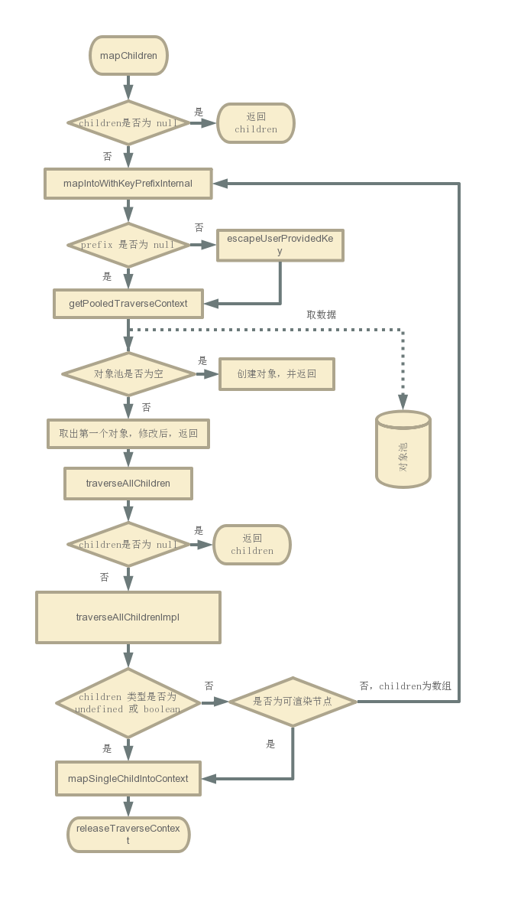

# React 系列之 ReactChildren 解读

## 前言

一直想学习 React 源码，终于今天看完了 ReactChildren 的源码，特来阐述下学到的知识。写这篇文章，是受到 [剖析 React 源码：先热个身](https://juejin.im/post/5cbae9a8e51d456e2809fba3) 的启发，希望这篇文章可以带来不一样的体验。

## 正文

打开 `ReactChildren.js` 文件内部暴露出下面几个方法。

```js
export {
    forEachChildren as forEach,
    mapChildren as map,
    countChildren as count,
    onlyChild as only,
    toArray
};
```

### forEachChildren

1. 判断 `children` 是否为 `null`，如果是，则` return children`。
2. 调用 `getPooledTraverseContext` 方法获取 `traverseContext` 对象，此方法是维护一个对象池，每次都会先去对象池内取对象，如果对象池没有对象，则新建，否则取出最后一个对象，修改属性值再使用。
3. 调用 `traverseAllChildrenImpl`，如果是可渲染节点，则调用 `forEachSingleChild` 方法。如果是数组或类数组，则再次调用 `traverseAllChildrenImpl`。

### mapChildren



1. 判断 `children` 是否为 `null`，如果是，则` return children`，如果不是，则调用 `mapIntoWithKeyPrefixInternal`。
2. 同 `forEachChildren` 第二步。
3. 同 `forEachChildren` 第三步。但是 `map` 方法对于可渲染节点调用的方法是 `mapSingleChildIntoContext`。这个函数会判断函数返回值是否为数组，如果是，则再次循环调用 `mapIntoWithKeyPrefixInternal`。这样也就意味着，当你写如下代码时候，最终结果仍是一维数组。

    ```js
    ReactChildren.mapChildren(this.props.children, (child)=>{ return [child, child] })
    ```

## 拓展阅读

### 对象池相关知识

- [JavaScript设计模式之享元模式](https://juejin.im/entry/5bcffdafe51d457ab36cfa30)
- [Static Memory Javascript with Object Pools](https://www.html5rocks.com/en/tutorials/speed/static-mem-pools/)
