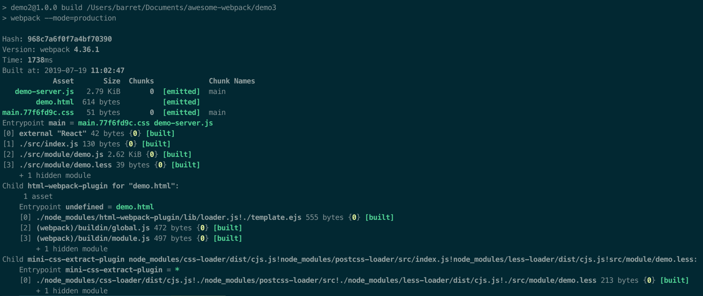
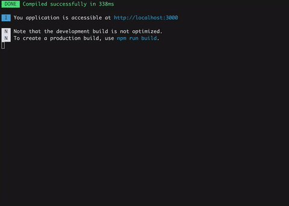
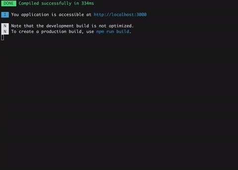

# 漫谈 Webpack 之优化构建输出

相信大家都遇到过这样的场景，当对你的项目进行 npm run build 的时候，你会发现你的命令行工具输出了以下信息。



实际上，这些信息对我们有用的仅仅只有几样，比如成功、警告、失败。其余的信息，你基本上不会关注，那要怎么去隐藏这些无用的信息呢？

## stats

这时，webpack 的 stats 属性浮现在我们眼前。

| Preset | Alternative | Description |
| ------ | ----------- | ----------- |
| "errors-only" | none | 只在发生错误时输出 |
| "minimal" | none | 只在发生错误或有新的编译时输出 |
| "none" | false | 没有输出 |
| "normal" | true | 标准输出 |
| "verbose" | none | 全部输出 |

当然，仅仅依靠 stats 是不能解决问题的，我们还需要借助于 friendly-errors-webpack-plugin 插件。

## 示例

- npm run build 的输出优化方式

    ```js
    var FriendlyErrorsWebpackPlugin = require('friendly-errors-webpack-plugin');
    module.exports = {
        stats: 'error-only',
        plugins: [
            new FriendlyErrorsWebpackPlugin()
        ]
    }
    ```

- npm run dev 的输出优化方式

    ```js
    var FriendlyErrorsWebpackPlugin = require('friendly-errors-webpack-plugin');
    module.exports = {
        devServer: {
            stats: 'error-only'
        },
        plugins: [
            new FriendlyErrorsWebpackPlugin()
        ]
    }
    ```

## 效果

- Build success

    

- eslint-loader errors

    

- babel-loader syntax errors

    

