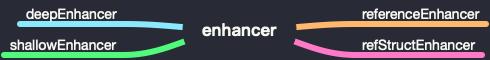

# Mobx 源码初探 - observable（二）

> [上一节](./20190811.md)讲到，`observable` 不仅支持 `decorator` 方式，还支持方法调用。

## observable

```js
age = observable(12)
```

`observable` 共有 13 种方法，其中 `shallowBox`、`shallowArray`、`shallowMap` 和 `shallowObject` 已经废弃。


- `box`、`shallowBox`、`array`、`shallowArray`、`map`、`shallowMap`、`set` 会判断参数是否大于 **2**，如果大于则报错。

- `object` 会判断第二个参数是否为 `string`，如果不是则报错。

## ref、shallow、deep、struct

`ref`、`shallow`、`deep`、`struct` 四个方法很有意思，其中 `deep` 对应的是 `deepDecorator` 方法，当我们调用 `@observable.deep` 就相当于调用 `@observable`，剩下的三个则对应不同的 `enhancer`。

> 注：如果直接调用这个四个方法，会返回描述符，所以我们的调用方式仍然为 `@observable.deep`。

### enhancer

`mobx` 共有四个 `enhancer` 函数。



#### deepEnhancer

`deepEnhancer` 在上一节已经讲过，其是任何 `observable` 都使用的默认的调节器。它将任何(尚未成为 `observable` )数组，映射或纯对象克隆并转换为 `observable` 对象，并将其赋值给给定属性。

#### shallowEnhancer

只能与集合组合使用。将任何分配的集合转换为 observable，但该集合的值将按原样处理。

#### referenceEnhancer

不转换为 `observable`。

```js
function referenceEnhancer(newValue) {
    // never turn into an observable
    return newValue;
}
```

#### refStructEnhancer

就像 `referenceEnhancer`, 但会忽略结构上等于当前值的新值。

```js
function refStructEnhancer(v, oldValue, name) {
    if (true && isObservable(v))
        throw "observable.struct should not be used with observable values";
    if (deepEqual(v, oldValue)) return oldValue;
    return v;
}
```

## observable.box

### 用法

```js
name = observable.box(2)
```

### 源码解读

`observable.box` 接收两个参数 `value` 和 `options`，方法内部首先判断是否以 `decorator` 方式调用，如果是则报错，否则调用 `asCreateObservableOptions` 生成 `options`。

```js
if (arguments.length > 2) incorrectlyUsedAsDecorator("box");
var o = asCreateObservableOptions(options);
return new ObservableValue(value, getEnhancerFromOptions(o), o.name, true, o.equals);
```

`asCreateObservableOptions` 会校验传入的第二个参数格式，如果第二个参数为 `null` 或 `undefined`，则返回 `defaultCreateObservableOptions`。否则判断传入的类型是否为 `string` 和 `object`，如果都不是，则报错，否则进行进一步的校验。

```js
function asCreateObservableOptions(thing) {
    if (thing === null || thing === undefined) return defaultCreateObservableOptions;
    if (typeof thing === 'string') return { name: thing, deep: true };
    if (true) {
        if (typeof thing !== 'object') return fail('expected options object');
        Object.keys(thing).forEach(assertValidOption);
    }
    return thing;
}
```

在 `observable.box` 函数内部，同样也会调用 `new ObservableValue` 来生成 `observable` 数据，区别就是 `enhancer` 会根据传入的第二个参数判断使用使用哪种 `enhancer`，`notifySpy` 为 `true` 和最后一个参数。

```js
// observable.box
new ObservableValue(value, getEnhancerFromOptions(o), o.name, true, o.equals);
// @observable
new ObservableValue(newValue, enhancer, adm.name + "." + propName, false);
```

### ObservableValue

上一节我们提到了关于 `ObservableValue` 的一部分知识，这里会继续深入了解。`ObservableValue` 接收 `value`, `enhancer`, `name`, `notifySpy`, `equals` 几个参数。

由于传入的 `notifySpy` 为 `true`，所以相比 `@observable` 多走一个判断。它会首先判断当前全局是否有全局 `spy` 监听器，如果有，则发送一个事件，剩下的和 `@observable` 所做的事相同。

```js
if (notifySpy && isSpyEnabled()) {
    // only notify spy if this is a stand-alone observable
    spyReport({ type: "create", name: _this.name, newValue: "" + _this.value });
}
```

## observable.array

方法内部实例化 `ObservableArray`，`ObservableArray` 继承 `StubArray`，`StubArray` 继承 `Array`。

```js
var extendStatics = function(d, b) {
    extendStatics =
        Object.setPrototypeOf ||
        ({ __proto__: [] } instanceof Array &&
            function(d, b) {
                d.__proto__ = b;
            }) ||
        function(d, b) {
            for (var p in b) if (b.hasOwnProperty(p)) d[p] = b[p];
        };
    return extendStatics(d, b);
};

function __extends(d, b) {
    extendStatics(d, b);
    function __() {
        this.constructor = d;
    }
    d.prototype = b === null ? Object.create(b) : ((__.prototype = b.prototype), new __());
}

var ObservableArray = (function(_super) {
    ...
    __extends(ObservableArray, _super);
    ...
})(StubArray);
```

### `__proto__`

我们从继承源码中看见这样一句代码，`({ __proto__: [] } instanceof Array)` ，这句代码啥意思呀？这是个什么造型啊，挺别致啊。我们在控制台打印下，发现输出 `true`，于是开始怀疑人生中。。。


> MDN：__proto__的读取器(getter)暴露了一个对象的内部 [[Prototype]] 。对于使用对象字面量创建的对象，这个值是 Object.prototype。对于使用数组字面量创建的对象，这个值是 Array.prototype。对于functions，这个值是Function.prototype。

```js
({ __proto__: [] } instanceof Array) // true
({ __proto__: {} } instanceof Object) // true
({ __proto__: function(){} } instanceof Function) // true
({ __proto__: 2 } instanceof Object) // true
({ __proto__: 'abc' } instanceof Object) // true
({ __proto__: true } instanceof Object) // true
({ __proto__: NaN } instanceof Object) // true
({ __proto__: null } instanceof Object) // false
Object.getPrototypeOf({ __proto__: null }) // null
```

在控制台可以看到 `{ __proto__: null }`，生成的对象没有原型链，这与我们通过 `Object.create(null)` 得到的结果是一致的。

我们开始怀疑是不是通过 `{__proto__: []}` 与 `Object.create([])` 得到的结果一致？由于 `Object.create` 第一个参数接收对象，故只测试以下情况。

```js
Object.create([]) instanceof Array // true
Object.create({}) instanceof Object // true
Object.create(function(){}) instanceof Function // true
Object.getPrototypeOf(Object.create(null) ) // null
```

## observable.map

```js
return new ObservableMap(initialValues, getEnhancerFromOptions(o), o.name);
```

## observable.set

```js
return new ObservableSet(initialValues, getEnhancerFromOptions(o), o.name);
```

## observable.object

```js
return extendObservable({}, props, decorators, o);
```
