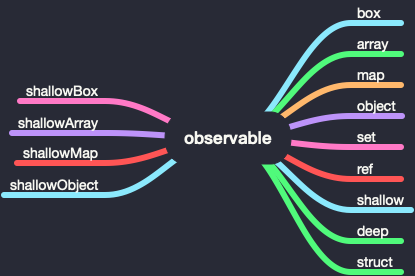

# Mobx 源码初探 - observable（二）

> [上一节](./20190811.md)讲到，`observable` 不仅支持 `decorator` 方式，还支持方法调用。

## observable

```js
age = observable(12)
```

`observable` 共有 13 种方法，其中 `shallowBox`、`shallowArray`、`shallowMap` 和 `shallowObject` 已经废弃。



- `box`、`shallowBox`、`array`、`shallowArray`、`map`、`shallowMap`、`set` 会判断参数是否大于 **2**，如果大于则报错。

- `object` 会判断第二个参数是否为 `string`，如果不是则报错。

## ref、shallow、deep、struct

`ref`、`shallow`、`deep`、`struct` 四个方法很有意思，其中 `deep` 对应的是 `deepDecorator` 方法，当我们调用 `@observable.deep` 就相当于调用 `@observable`，剩下的三个则对应不同的 `enhancer`。

> 注：如果直接调用这个四个方法，会返回描述符，所以我们的调用方式仍然为 `@observable.deep`。

### enhancer

`mobx` 共有四个 `enhancer` 函数。


#### deepEnhancer

`deepEnhancer` 在上一节已经讲过，其是任何 `observable` 都使用的默认的调节器。它将任何(尚未成为 `observable` )数组，映射或纯对象克隆并转换为 `observable` 对象，并将其赋值给给定属性。

#### shallowEnhancer

只能与集合组合使用。将任何分配的集合转换为 observable，但该集合的值将按原样处理。

#### referenceEnhancer

不转换为 `observable`。

```js
function referenceEnhancer(newValue) {
    // never turn into an observable
    return newValue;
}
```

#### refStructEnhancer

就像 `referenceEnhancer`, 但会忽略结构上等于当前值的新值。

```js
function refStructEnhancer(v, oldValue, name) {
    if (true && isObservable(v))
        throw "observable.struct should not be used with observable values";
    if (deepEqual(v, oldValue)) return oldValue;
    return v;
}
```

## observable.box

### 用法

```js
name = observable.box(2)
```

### 源码解读

`observable.box` 接收两个参数 `value` 和 `options`，方法内部首先判断是否以 `decorator` 方式调用，如果是则报错，否则调用 `asCreateObservableOptions` 生成 `options`。

```js
if (arguments.length > 2) incorrectlyUsedAsDecorator("box");
var o = asCreateObservableOptions(options);
return new ObservableValue(value, getEnhancerFromOptions(o), o.name, true, o.equals);
```

`asCreateObservableOptions` 会校验传入的第二个参数格式，如果第二个参数为 `null` 或 `undefined`，则返回 `defaultCreateObservableOptions`。否则判断传入的类型是否为 `string` 和 `object`，如果都不是，则报错，否则进行进一步的校验。

```js
function asCreateObservableOptions(thing) {
    if (thing === null || thing === undefined) return defaultCreateObservableOptions;
    if (typeof thing === 'string') return { name: thing, deep: true };
    if (true) {
        if (typeof thing !== 'object') return fail('expected options object');
        Object.keys(thing).forEach(assertValidOption);
    }
    return thing;
}
```

在 `observable.box` 函数内部，同样也会调用 `new ObservableValue` 来生成 `observable` 数据，唯一的区别就是第四个参数为 `true` 和拥有最后一个参数。

```js
// observable.box
new ObservableValue(value, getEnhancerFromOptions(o), o.name, true, o.equals);
// @observable
new ObservableValue(newValue, enhancer, adm.name + "." + propName, false);
```

### ObservableValue

上一节我们提到了关于 `ObservableValue` 的一部分知识，这里会继续深入了解。`ObservableValue` 接收 `value`, `enhancer`, `name`, `notifySpy`, `equals` 几个参数。

由于传入的 `notifySpy` 为 `true`，所以相比 `@observable` 多走一个判断。它会首先判断当前全局是否有全局 `spy` 监听器，如果有，则发送一个事件，剩下的和 `@observable` 所做的事相同。

```js
if (notifySpy && isSpyEnabled()) {
    // only notify spy if this is a stand-alone observable
    spyReport({ type: "create", name: _this.name, newValue: "" + _this.value });
}
```

## observable.array

这里实例化 `ObservableArray`，其继承 `StubArray`。

```js
var StubArray = (function() {
    function StubArray() {}
    return StubArray;
})();
function inherit(ctor, proto) {
    if (typeof Object['setPrototypeOf'] !== 'undefined') {
        Object['setPrototypeOf'](ctor.prototype, proto);
    } else if (typeof ctor.prototype.__proto__ !== 'undefined') {
        ctor.prototype.__proto__ = proto;
    } else {
        ctor['prototype'] = proto;
    }
}
inherit(StubArray, Array.prototype);
```

## observable.map

```js
return new ObservableMap(initialValues, getEnhancerFromOptions(o), o.name);
```

## observable.set

```js
return new ObservableSet(initialValues, getEnhancerFromOptions(o), o.name);
```

## observable.object

```js
return extendObservable({}, props, decorators, o);
```
