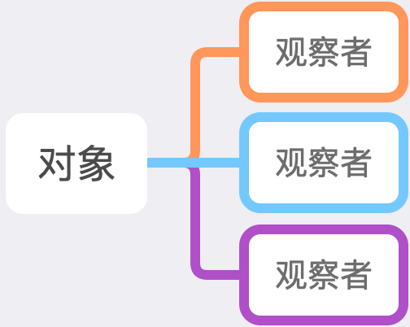
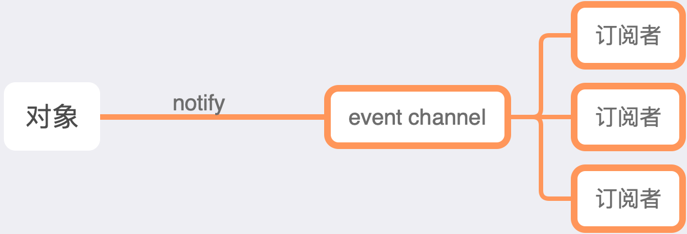

# 观察者与订阅 - 发布模式的区别

> 一直对设计模式不上心，自从最近看 `mobx` 源码，发现对设计模式越了解，越容易理解作者的初衷之后，便开始恶补。

初以为观察者模式就是订阅 - 发布模式，但是自从无意中看到网上有人问观察者与订阅 - 发布模式有什么区别之后，便开始怀疑人生。于是上网查询资料，整理而成此篇文章。

## 观察者模式

一个对象拥有许多观察者，每当对象上任一属性发生变化，都会通知到观察者。观察者是知道对象存在。

## 订阅 - 发布模式

一个对象拥有许多观察者，每当对象上任一属性发生变化，都会通知到中间件，中间件再通知到观察者。观察者是不知道发布者存在，发布者也不知道订阅者存在，避免发布者与订阅者之间产生依赖关系。

## 区别

- 订阅 - 发布模式多了一个事件池概念
- 订阅 - 发布模式下发布者不知道订阅者，订阅者也不知道发布者
