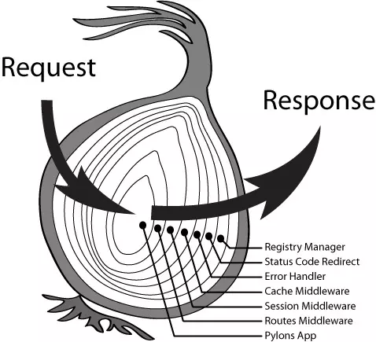

# Koa 源码解读



`koa` 是一个新的 `web` 框架，致力于成为 `web` 应用和 `API` 开发领域中的一个更小、更富有表现力、更健壮的基石。但是每当说起 `koa` ，都可以想到中间件或洋葱模型，那如何理解它是一个中间件或洋葱模型，今天就带大家通过源码的方式理解下。

## 监听端口号

通过 `http.createServer` 开启服务监听特定端口号，考虑到参数可能是多个，所以用了 `...args`。

```js
// application.js
listen(...args) {
    const server = http.createServer(this.callback());
    return server.listen(...args);
}
```

## 创建上下文

`koa` 通过 `createContext` 方法创建上下文。可以注意到 `context` 上挂载了原始的 `req` 与 `res`，同时也挂载了我们自定义的 `context`、 `request` 和 `response`。在自定义内部，我们通过 `delegates` 便捷操作属性，其本质上是通过 `get` 和 `set` 实现。

```js
// application.js
createContext(req, res) {
    const context = Object.create(this.context);
    const request = context.request = Object.create(this.request);
    const response = context.response = Object.create(this.response);
    context.app = request.app = response.app = this;
    context.req = request.req = response.req = req;
    context.res = request.res = response.res = res;
    request.ctx = response.ctx = context;
    request.response = response;
    response.request = request;
    context.originalUrl = request.originalUrl = req.url;
    context.state = {};
    return context;
}

// context.js
delegate(proto, 'response')
    .method('attachment')
    .method('redirect')
    .method('remove')
    .method('vary')
    .method('set')
    .method('append')
    .method('flushHeaders')
    .access('status')
    .access('message')
    .access('body')
    .access('length')
    .access('type')
    .access('lastModified')
    .access('etag')
    .getter('headerSent')
    .getter('writable');
```

## 中间件

```js
function add(x, y){
    return x + y;
}
function square(x){
    return x ** 2;
}
```

我们想顺序调用 `add`、`square` 方法来计算数据，那我们的调用函数为 `square(add(1, 2))`。

我们改变一下场景，如果调用的函数又多了一个 `double` 函数，那我们的调用函数为 `double(square(add(1, 2)))`。

```js
function double(x){
    return 2 * x;
}
```

如果调用的函数个数不固定呢？那我们则需把调用的函数给合并成一个。

```js
let middleware = [add, square, double]

function compose(middleware){
    return middleware.reduce((prevFn, currentFn)=>(...args)=>currentFn(prevFn(...args)))
}

let composeFn = compose(middleware)

composeFn(1, 2)

```

我们来调用下 `compose` 函数，可以发现输出了 `18`，证明这个函数式正确的。`compose` 函数在这里就充当了中间件，但是我们的中间件是**同步**的，而 `koa` 是**异步**中间件，那异步中间件该如何去做？

```js
// 异步中间件
function compose(middleware){
    return function(context, next){
        let index = -1;
        return dispatch(0);
        function dispatch(i){
            if (i <= index) return Promise.reject(new Error('next() called multiple times'))
            index = i;
            let fn = middleware[i];
            if(i === middleware.length) fn = next;
            if(!fn) return Promise.resolve();
            try {
                return Promise.resolve(fn(context, dispatch.bind(null, i + 1)));
            } catch (err) {
                return Promise.reject(err);
            }
        }
    }
}

// koa 示例
app.use(async (ctx, next)=>{
    console.log(1)
    await next();
    console.log(4)
})

app.use(async (ctx, next)=>{
    console.log(2)
    await next();
    console.log(5)
})

app.use(async (ctx, next)=>{
    console.log(3)
    await next();
    ctx.body = 'Hello, Koa';
    console.log(6)
})
```

我们每一次的 `next` 都为下一个异步函数，且每一个函数内部均有 `await`，所以当我们的函数顺序执行完毕之后，便会反方向依次调用剩下代码，所以这一段代码输出为 *123654*。

说到这里，是不是就可以理解为什么我们说 `koa` 像一个洋葱，从上到下一个一个执行，然后从下往上再一层一层回去。
